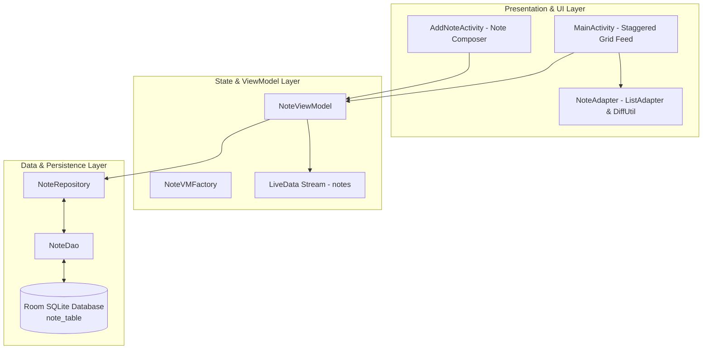

# NoteStash

[](https://www.android.com/)
[](https://kotlinlang.org/)
[](https://developer.android.com/topic/architecture)
[-4CAF50?style=for-the-badge&logo=sqlite&logoColor=white)](https://developer.android.com/training/data-storage/room)
[](https://developer.android.com/)
[-00BCD4?style=for-the-badge)](https://developer.android.com/)
[](LICENSE)

> A lightweight, privacy-centric Android note-taking application featuring dynamic 2-column Staggered Grid layouts, Room SQLite persistence, DiffUtil animations, and non-destructive delete with Snackbar undo.

---

## 📖 Overview

**NoteStash** is a clean, distraction-free note-taking utility designed for rapid thought capture, organized visual browsing, and zero-latency local retrieval on Android. Built entirely on **Room ORM** and **Android Jetpack** components, NoteStash requires no accounts, no subscriptions, and zero network access.

The interface presents notes in a flexible two-column **Staggered Grid (Masonry)** layout that automatically adjusts to note lengths, complemented by vibrant gradient styling, smooth list update animations via `DiffUtil`, and resilient deletion safeguards with instant `Snackbar` undo recovery.

### Why NoteStash?
- **Staggered Grid Visualization**: Masonry card layout maximizes screen real estate and handles varying note lengths gracefully.
- **Immediate Local Persistence**: Room database executes queries on background coroutine dispatchers for zero UI hitching.
- **Safety First (Undo Support)**: Accidental note deletions can be instantly reverted with a single tap on the Snackbar action.
- **100% Offline & Private**: Notes never leave your device.

---

## 🏗️ Architecture & Data Flow

NoteStash follows the standard **Android Jetpack MVVM (Model-View-ViewModel)** architectural pattern.



---

## ✨ Core Features

### 📌 Staggered Grid Masonry Feed
- Multi-column `StaggeredGridLayoutManager` adapts dynamically to variable text content lengths.
- Clean Material card elevations with distinct header typography and responsive touch targets.

### ⚡ Rapid Thought Capture
- Streamlined `AddNoteActivity` allows users to jot down ideas with a dedicated title and expansive body text editor.
- Floating Action Button with Material 3 iconography and extended label styling.

### 🔄 Non-Destructive Deletions & Undo
- One-tap delete with integrated callback handling.
- Displays an interactive `Snackbar` allowing users to **Undo** note deletion, restoring the entity to Room instantly.

### 🚀 Asynchronous Room Operations
- Reactive `LiveData` observation automatically triggers `ListAdapter` updates using `DiffUtil` calculations on background threads.
- SQLite transactions performed via Kotlin Coroutines on `Dispatchers.IO`.

---

## 📱 Key Screens & UI Components

| Screen / Component | Class | Description |
|---|---|---|
| **Notes Dashboard** | `MainActivity` | Displays the 2-column masonry grid, CoordinatorLayout toolbar, and Add Note FAB. |
| **Add Note Sheet** | `AddNoteActivity` | Dedicated composition screen for note title and multi-line content. |
| **Grid List Adapter**| `NoteAdapter` | `ListAdapter` leveraging `DiffUtil.ItemCallback` with delete and undo hooks. |
| **Data Entity** | `Note` | Room entity representing notes with auto-generated ID, title, and body. |
| **Data Access Object**| `NoteDao` | Defines SQL queries for insert, delete, and real-time LiveData note retrieval. |

---

## 🛠️ Technical Stack Matrix

| Layer / Concern | Technology / Library | Version / Details |
|---|---|---|
| **Platform** | Android OS | `minSdk 24` (Android 7.0) / `targetSdk 35` (Android 15) / `compileSdk 35` |
| **Language** | [Kotlin](https://kotlinlang.org/) | 1.9+ |
| **Architecture** | MVVM + Repository Pattern | Android Jetpack Architecture Components |
| **Local Database** | [Room Persistence Library](https://developer.android.com/training/data-storage/room) | `2.7.0` SQLite ORM with Kotlin KAPT |
| **UI Components** | AndroidX & Material Design 3 | CoordinatorLayout, MaterialToolbar, ExtendedFAB, StaggeredGrid RecyclerView |
| **Concurrency** | Kotlin Coroutines | Asynchronous database execution via `Dispatchers.IO` |
| **View Binding** | Android ViewBinding | Type-safe layout inflation and view references |
| **Build System** | Gradle Kotlin DSL (`build.gradle.kts`) | AGP 8.7+ |

---

## 📂 Project Structure

```text
NoteStash/
├── app/
│   ├── src/
│   │   ├── main/
│   │   │   ├── java/com/example/note_takingapp/
│   │   │   │   ├── MainActivity.kt                # Primary screen with Staggered Grid
│   │   │   │   ├── data/
│   │   │   │   │   ├── Note.kt                    # Room Note entity
│   │   │   │   │   ├── NoteDao.kt                 # Room DAO with LiveData queries
│   │   │   │   │   ├── NoteDatabase.kt            # Room database instance
│   │   │   │   │   └── NoteRepository.kt          # Clean repository pattern
│   │   │   │   └── ui/
│   │   │   │       ├── AddNoteActivity.kt         # Note creator activity
│   │   │   │       ├── NoteViewModel.kt           # Note ViewModel & ViewModelFactory
│   │   │   │       └── adapter/
│   │   │   │           └── NoteAdapter.kt         # ListAdapter with DiffUtil & delete callback
│   │   │   ├── res/
│   │   │   │   ├── drawable/                      # Gradient backgrounds & icons
│   │   │   │   ├── layout/
│   │   │   │   │   ├── activity_main.xml          # Staggered RecyclerView layout
│   │   │   │   │   ├── activity_add_note.xml      # Note composer layout
│   │   │   │   │   └── item_note.xml              # Staggered grid note card layout
│   │   │   │   └── values/                        # Color schemes and themes
│   │   │   └── AndroidManifest.xml
│   ├── build.gradle.kts
│   └── proguard-rules.pro
├── gradle/
│   └── libs.versions.toml
├── build.gradle.kts
├── LICENSE
└── README.md
```

---

## 🚀 Getting Started

### Prerequisites
- **Android Studio** (Ladybug 2024.2+ or Hedgehog+).
- **JDK 17** or **JDK 21**.
- Android device or Emulator running **API 24 (Android 7.0)** or higher.

### Installation & Build

1. **Clone the repository**:
   ```bash
   git clone https://github.com/shayann07/NoteStash.git
   cd NoteStash
   ```

2. **Open in Android Studio**:
   - Open the directory in Android Studio and let Gradle sync dependencies.

3. **Build the APK**:
   ```bash
   ./gradlew assembleDebug
   ```

4. **Run on Device**:
   ```bash
   ./gradlew installDebug
   ```

---

## 📄 License

This project is licensed under the **MIT License** — see the [LICENSE](LICENSE) file for complete details.

```text
Copyright (c) 2026 shayann07
```
